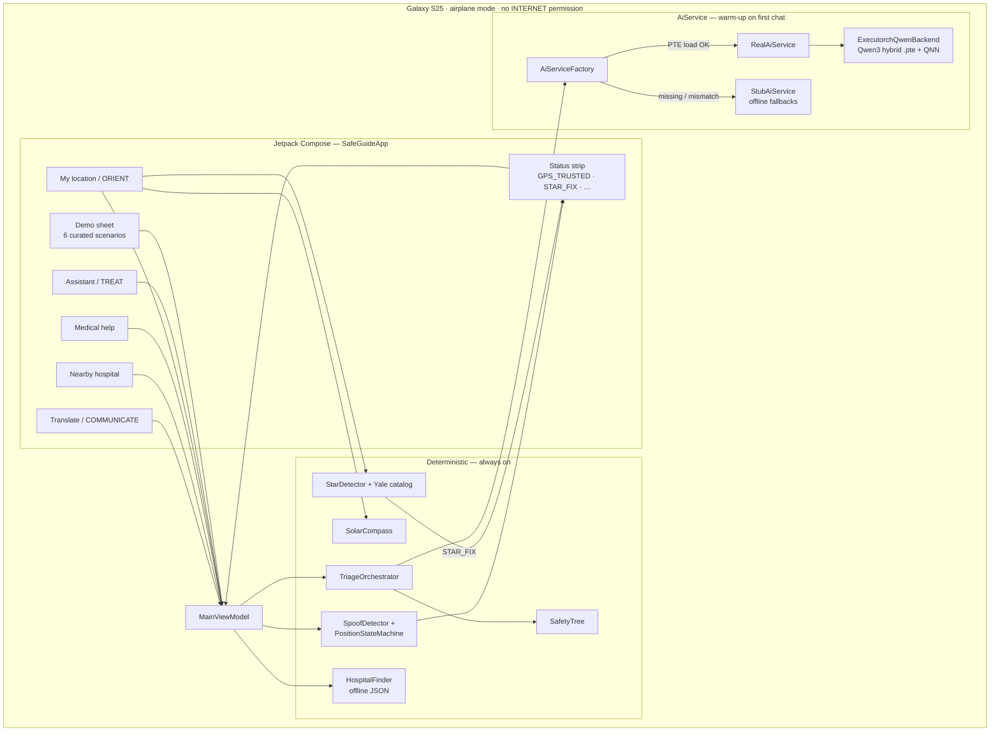

# Lodestar

<p align="center">
  
  
</p>
<p align="center">
  
  
  
</p>

> 🏆 **Winner — Copilot-Powered Build Award** at the Qualcomm × Meta ExecuTorch Hackathon — recognized for creative and effective use of GitHub Copilot during the build. See the app in action in [`docs/SCREENSHOTS.md`](docs/SCREENSHOTS.md).

An **offline, on-device AI survival copilot** for the Qualcomm × Meta ExecuTorch Hackathon.
GPS jammed, network down, airplane mode on — talk to your phone for true-north heading and
first-aid triage. Inference runs on the Snapdragon NPU when a matching Qwen `.pte` is installed;
deterministic safety logic always works without the cloud.

**Built by**
- **Arpanjeet Singh** — on-device AI (ExecuTorch + QNN)
- **Manjeet Singh** — app, medical corpus, navigation, pitch

License: MIT · **Target device:** Galaxy S25 Ultra (SM8750 / Snapdragon 8 Elite)

| Doc | Purpose |
|-----|---------|
| [`HANDOFF.md`](HANDOFF.md) | Agent / new-chat context |
| [`SETUP.md`](SETUP.md) | WSL + Android Studio setup |
| [`DEMO.md`](DEMO.md) | 5-minute judge script |
| [`docs/DEMO_SAFE_RUNBOOK.md`](docs/DEMO_SAFE_RUNBOOK.md) | Failure-safe demo recovery |

---

## What it does

| Tab | Capability |
|-----|------------|
| **Assistant (TREAT)** | Voice/text triage → **SafetyTree** severity (CRITICAL / SERIOUS / …) + offline guidance |
| **My location (ORIENT)** | Solar compass (day) · night-sky **STAR_FIX** (import photo) · trust strip (`GPS_TRUSTED` / `DEAD_RECKONING` / `STAR_FIX`) |
| **Medical help** | Wound photo checklist + field-kit reference (not prescriptions) |
| **Nearby hospital** | Offline SF ER list — distance + bearing from cached position |
| **Translate (COMMUNICATE)** | Medic↔casualty phrase helper + SOS summary card |

**Signature UI:** high-contrast calm shell, persistent **Offline ready** / position pill, and a **Demo** button that runs curated judge scenarios with zero mic or NPU required. No `INTERNET` permission.

---

## Demo walkthrough (in-app + bundled assets)

Tap **Demo** on any screen → pick a scenario. All flows work in **airplane mode**.

### 1 · Assistant — negation triage (SafetyTree)

Type or use the demo sheet:

- `"The bleeding hasn't stopped"` → **CRITICAL**
- `"The bleeding has stopped now"` → **SERIOUS**

The severity label comes from deterministic rules, not the language model.

### 2 · My location — Powell St + hospitals

Demo sets GPS to **Powell & Sutter, SF** (`37.789261, -122.408653`). Open **Nearby hospital** for Saint Francis Memorial ~**0.7 km west**.

<p align="center">
  
  <br><sub><b>ORIENT demo context</b> — Powell St reference photo (bundled in <code>assets/demo/</code>)</sub>
</p>

### 3 · Night sky — STAR_FIX (~47°)

**Demo → Night sky STAR_FIX** loads the Treasure Island photo. Star detection + Yale bright-star catalog produce heading without network.

<p align="center">
  
  &nbsp;&nbsp;
  
  <br><sub><b>Left:</b> imported night photo &nbsp;·&nbsp; <b>Right:</b> detected stars (solver output)</sub>
</p>

### 4 · Medical help — wound checklist

**Demo → Wound photo** loads a palm laceration image and walks through infection signs + field steps.

<p align="center">
  
  <br><sub><b>MEDICAL demo</b> — bundled wound photo → guided checklist in app</sub>
</p>

Full scenario list: [`samples/DEMO_SCENARIOS_IN_APP.md`](samples/DEMO_SCENARIOS_IN_APP.md) · stage assets: `.\scripts\demo_fix.ps1 -Action stage`

---

## Architecture



**NPU path:** export `.pte` with the same ExecuTorch **v1.0.0** + QNN **2.37.0.250724** toolchain as the Android AAR (`runtime/scripts/export_qwen06_sm8750.sh`), then `android/push_qwen_models.ps1`. Pre-built third-party `.pte` files often fail with error **30010** (runtime mismatch).

---

## Repo layout

```
android/          Jetpack Compose app (open in Android Studio)
runtime/          ExecuTorch + QNN build/export scripts (WSL)
corpus/           First-aid JSON corpus (TCCC / MARCH chunks)
docs/images/      README demo photos
samples/          Judge scripts + downloadable demo assets
scripts/          demo_fix.ps1, Python verification
```

---

## Quick start

### Android (works now — Demo mode needs no NPU)

```powershell
cd android
.\gradlew.bat installDebug
```

Open on device → tap **Demo** → **Full demo (start here)**. Or follow [`DEMO.md`](DEMO.md).

### Python verification (no SDK)

```powershell
python scripts\verify_safety_tree.py
python scripts\verify_solar_math.py
```

### NPU / Qwen (WSL + QNN SDK)

```bash
# WSL — build matching AAR
bash runtime/scripts/assemble_android_aar.sh

# Export SM8750 PTE (30–90 min calibration)
bash runtime/scripts/export_qwen06_sm8750.sh
```

```powershell
# Windows — push model + install app
.\android\push_qwen_models.ps1 -Model 0.6b
cd android; .\gradlew.bat installDebug
```

See **`SETUP.md`** for full environment setup.

---

## Swapping in real models

`AiServiceFactory` starts on **StubAiService** (safe at launch), then tries one NPU warm-up per chat:

```kotlin
// MainViewModel — per message
val aiService = AiServiceFactory.serviceForQuery(application)
```

Interface: `android/.../ai/AiService.kt` · backend: `ExecutorchQwenBackend.kt` · pins: `DECISIONS.md`

---

## ⚠️ Hackathon prototype — not a medical device

Not clinically validated. Safety **classification** is deterministic; fluent LLM text requires a matching on-device `.pte`. See [`STATUS.md`](STATUS.md) for honest gaps.
