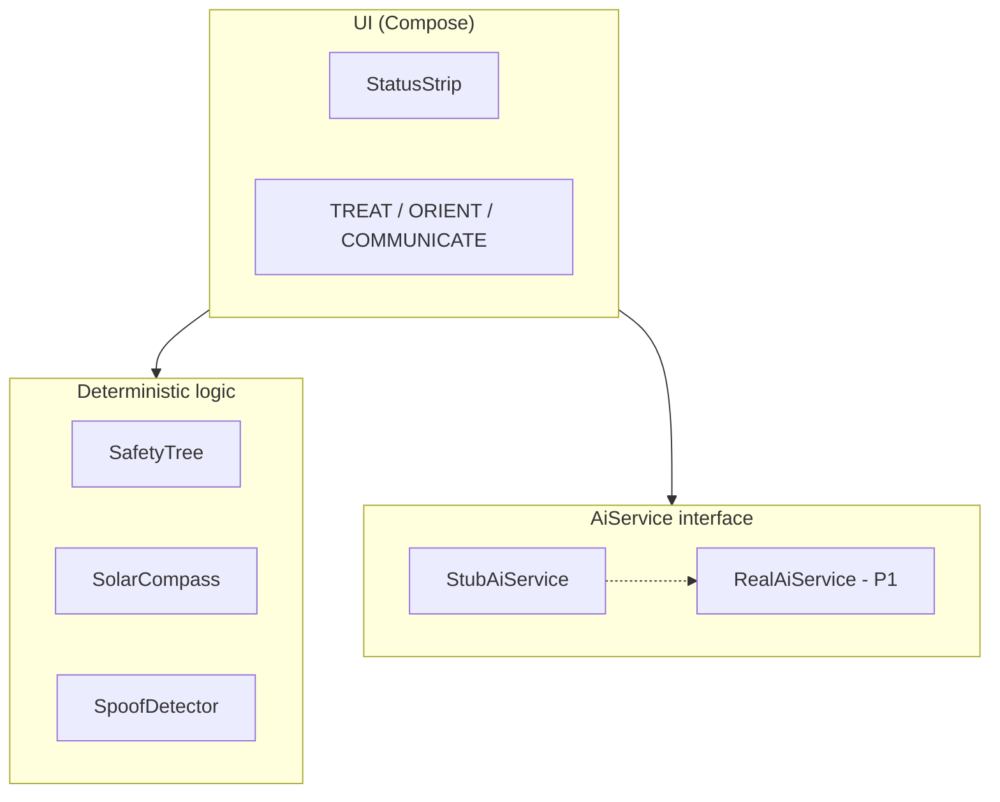

# Lodestar

An **offline, on-device AI survival copilot** for the Qualcomm × Meta ExecuTorch Hackathon.
GPS jammed, network down, airplane mode on — talk to your phone for true-north heading and
first-aid triage. All inference on the Snapdragon NPU.

Built by:
- **Arpanjeet Singh** — 106011010+arpan-s-dev@users.noreply.github.com — on-device AI models (ExecuTorch + QNN)
- **Manjeet Singh** — 62642705+manjeetsingh-satveer@users.noreply.github.com — app, medical corpus, navigation, pitch

License: MIT (see `LICENSE`). **Setup:** see `SETUP.md`.

---

## What it does

- **TREAT** — voice/text injury description → deterministic safety tree (not the LLM) sets
  severity → RAG-grounded first-aid guidance from offline TCCC/MARCH corpus → TTS output.
- **ORIENT** — solar compass true-north heading when GPS is spoofed or unavailable.
- **COMMUNICATE** — medic↔casualty translation + SOS distress summary card.

**Signature UI:** persistent status strip with position source (`GPS_TRUSTED` /
`DEAD_RECKONING` / `SOLAR_FIX`) + **AIRPLANE MODE** badge. No `INTERNET` permission.

---

## Repo layout

```
android/          Jetpack Compose app (open this folder in Android Studio)
runtime/          ExecuTorch + QNN build/export scripts (Person 1, WSL)
corpus/           First-aid JSON corpus (93 TCCC/MARCH chunks)
scripts/          Python verification (safety tree, solar math)
docs/             Pitch outline
SETUP.md          Step-by-step setup for WSL + Android Studio
STATUS.md         Live progress dashboard
```

---

## Quick start

### Android (Person 2 lane — works now with stubs)

```powershell
cd android
.\gradlew.bat test
```
Or open `android/` in Android Studio and Run on device.

### Python verification (no SDK needed)

```powershell
python scripts\verify_safety_tree.py
python scripts\verify_solar_math.py
```

### NPU / ExecuTorch (Person 1 lane — needs WSL + QNN SDK)

See **`SETUP.md`** — must be on branch `integrate/lodestar-v1` with `runtime/` present.

---

## Architecture



Full diagram and details in Person 2's original README sections — see `android/` source and
`docs/PITCH_OUTLINE.md`.

---

## Swapping in real models (Person 1)

In `android/app/src/main/java/com/medic/app/ui/MainViewModel.kt`:
```kotlin
private val aiService: AiService = StubAiService()  // → RealAiService()
```

Interface: `android/app/src/main/java/com/medic/app/ai/AiService.kt` (see `DECISIONS.md`).

---

## ⚠️ Hackathon prototype — not a medical device

Not clinically validated. See `STATUS.md` for honest gaps list.
