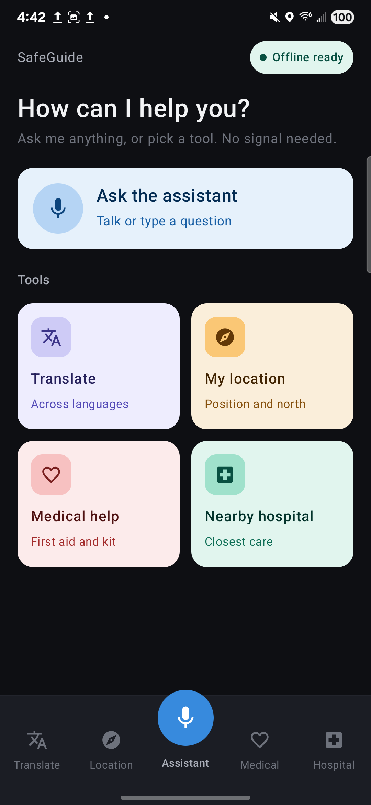
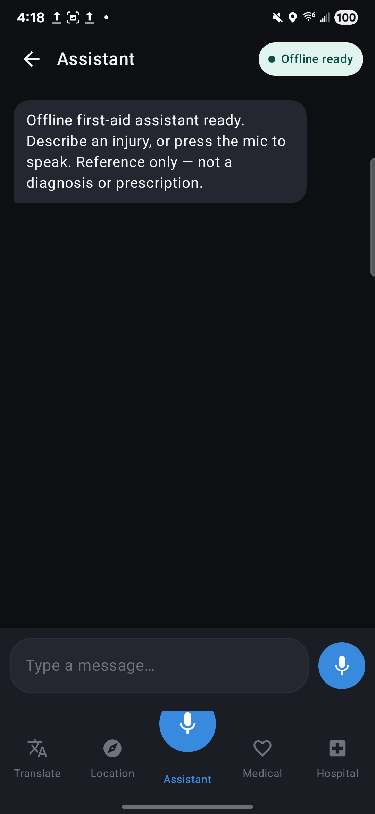
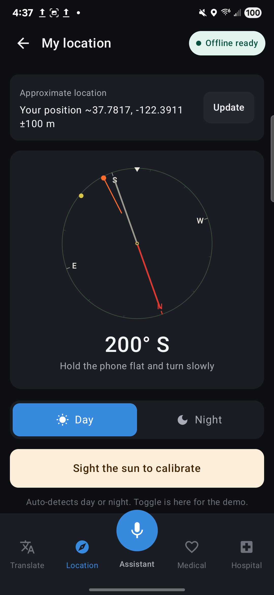
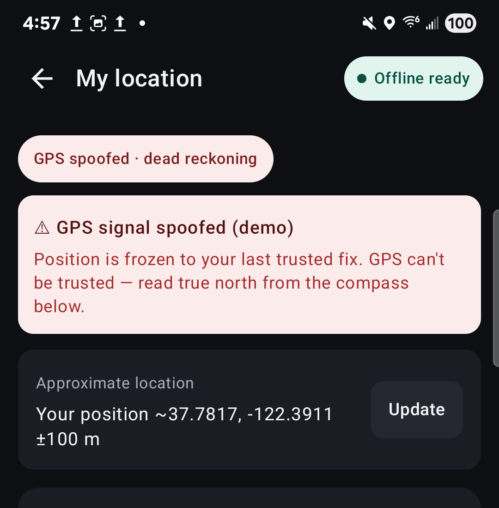
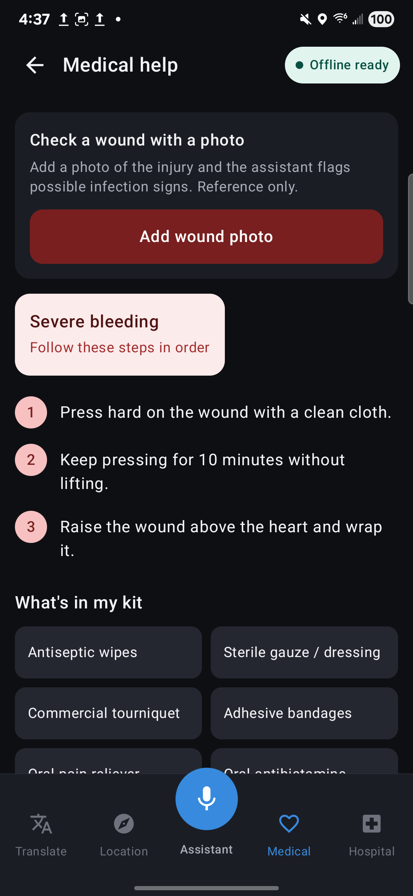
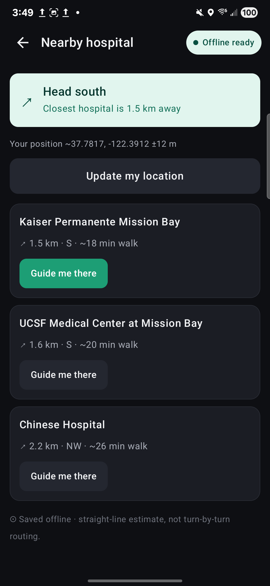
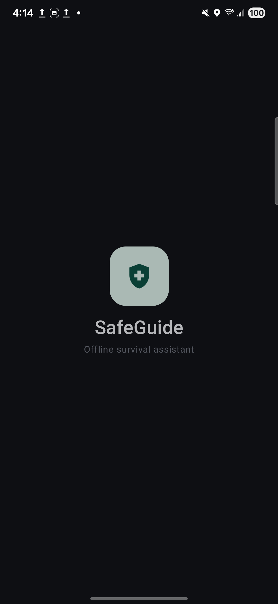

# SafeGuide — app screenshots

Real captures from the running app on a **Galaxy S25 Ultra**, fully offline. The
calm "SafeGuide" front-end sits over the Lodestar engine — on-device triage,
live compass, and nearest-hospital guidance with no network.

<table>
<tr>
<td align="center"><b>Home</b> "How can I help you?" — assistant front and center </td>
<td align="center"><b>Assistant</b> Voice/text first-aid triage </td>
<td align="center"><b>My location</b> Live compass + approximate position </td>
</tr>
<tr>
<td align="center"><b>GPS spoof (demo)</b> Detects spoofing, freezes to last trusted fix </td>
<td align="center"><b>Medical help</b> First-aid steps, kit, wound-photo check </td>
<td align="center"><b>Nearby hospital</b> Closest care + direction, offline </td>
</tr>
</table>

### Opening animation

---

All screens run with no internet permission. The bottom navigation puts the
assistant in the middle; the **My location** tab includes a demo "Simulate GPS
spoof" control that drives the real `PositionStateMachine` fallback to dead
reckoning, so the spoof-resilience story can be shown live.
