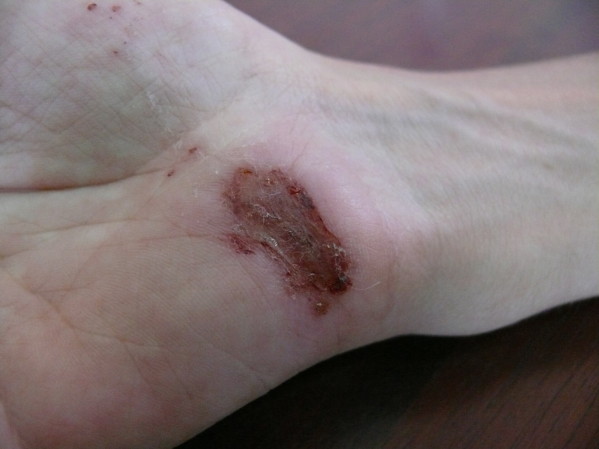
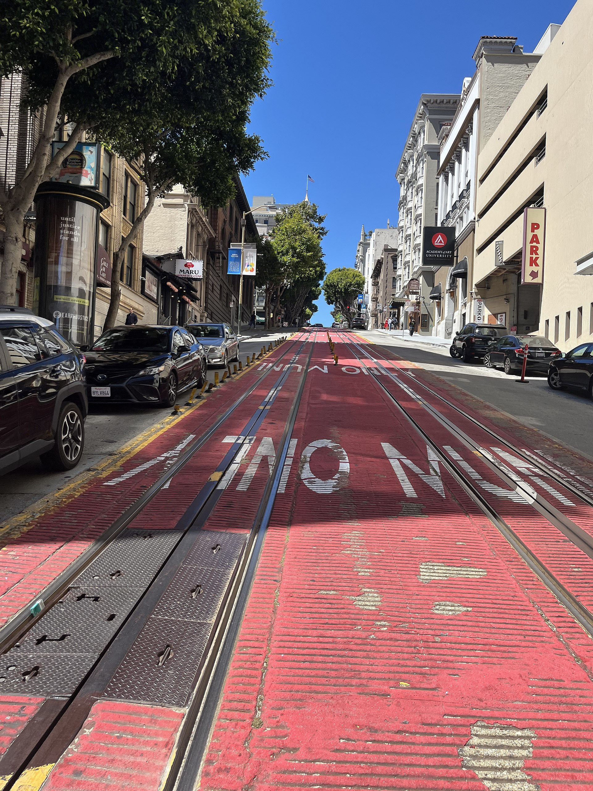

# Demo scenario — image + prompt + expected answer

> **Use on stage:** show the injury photo, type the prompt, then ORIENT with mock/cached position at Powell & Sutter.  
> Coordinates verified against Wikimedia Commons EXIF and `HospitalFinder` / `GeoMath` in the app.

---

## 1. Injury reference (show to judges)



*Public domain reference — [`demo_wounded_hand.jpg`](demo_wounded_hand.jpg)*

---

## 2. Field location (show on phone / slide)



| Field | Value |
|-------|-------|
| **Place** | Powell Street at Sutter Street, Union Square, San Francisco, CA |
| **Latitude** | `37.789261` |
| **Longitude** | `-122.408653` |
| **Camera heading** | `337.02°` (NNW — direction camera faced) |
| **Source** | [Wikimedia Commons CC0](https://commons.wikimedia.org/wiki/File:Powell_Street_from_Sutter_Street_(San_Francisco)_July_2022.JPG) |

**Mock GPS for demo** (Developer options → mock location app):

```
37.789261, -122.408653
```

---

## 3. USER PROMPT — copy into TREAT tab

```
I fell on the sidewalk and cut my palm — there's a lot of blood and it hasn't stopped. I'm near Powell Street in San Francisco and GPS is unreliable.
```

*(Optional: hold up `demo_wounded_hand.jpg` while saying it.)*

---

## 4. EXPECTED APP ANSWER (prompt-style)

### TREAT — SafetyTree (authoritative)

```
SEVERITY: CRITICAL
RULE: Active bleeding — "hasn't stopped"
DISCLAIMER: Reference / triage only — not a diagnosis.
```

**Say:** *"The CRITICAL label is deterministic — not from the LLM."*

### TREAT — Assistant text (stub or real LLM)

```
Apply firm direct pressure with a clean cloth to the palm wound.
Keep pressure continuous; elevate the hand if possible.
If bleeding does not stop, seek emergency care immediately.
[FA-0002] [FA-0004]

Disclaimer: This app does not replace professional medical care.
```

*(If stub: you'll see `[STUB RESPONSE]` — severity still real.)*

### ORIENT — Nearest hospitals from `37.789261, -122.408653`

```
POSITION: 37.789261°N, -122.408653°W  (Powell & Sutter, SF)
HEADING TO NEAREST ER:

  1. Saint Francis Memorial Hospital
     0.7 km  ·  270.4° (W)

  2. Chinese Hospital
     0.71 km  ·  358.2° (N)

  3. CPMC Van Ness Campus
     1.14 km  ·  254.4° (W)
```

### ORIENT — One line for judges

> **"Move W (~270°) toward Saint Francis Memorial Hospital — about 0.7 km by great-circle, offline from our baked hospital list."**

---

## 5. Live demo sequence (90 seconds)

1. Airplane mode ON · open Lodestar  
2. Show **wounded hand** image → type **USER PROMPT** in TREAT → point at **CRITICAL**  
3. Mock GPS to `37.789261, -122.408653` (or narrate if mock not ready)  
4. ORIENT → hospitals → confirm **#Saint Francis Memorial Hospital** appears first  
5. Show **Powell Street** photo: *"This is where we are; move W toward the nearest ER — offline."*

---

## 6. Recovery

```powershell
cd QCOM
.\scripts\demo_fix.ps1 -Action stage
```

Push scenario images:

```powershell
$ADB = "..\platform-tools\adb.exe"
$S = "samples"
& $ADB push "$S\demo_wounded_hand.jpg" /sdcard/Download/
& $ADB push "$S\demo_sf_powell_street.jpg" /sdcard/Download/
```
